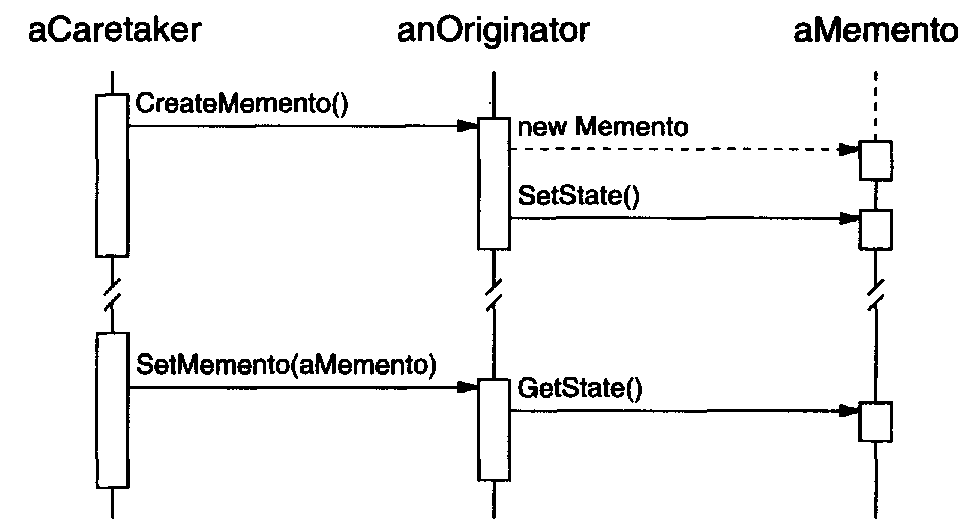

# Memento \(Token\)

## Introduction: {#introduction}

Without violating encapsulation, capture and externalize an object's internal state
 so that the object can be restored to this state later.


A Memento is a object that stores a snapshot of the internal state of the another object\(memento's originator\). 

That is, the originator create a snapshot of its internal state, and we call the snapshot object as Memento object.  
Only the originator
can store and retrieve information from the memento—the **memento** is "opaque"
to other objects.


## Motivation & When should use the pattern

* A snapshot of \(some portion of\) an object's state must be saved so that it can
   be restored to that state later.
* A direct interface to obtaining the state would expose implementation details
  and break the object's encapsulation.

## Component: {#component}

​




#### Memento

* Stores internal state of the Originator object
* Protects against access by objects other than the originator.


Memento should have two different interfaces:

* Caretaker sees a _**narrow**_ interface to the 
  Memento
* Originator, in
  contrast, sees a _**wide**_ interface, one that lets it access all the data necessary to
   restore itself to its previous state.


#### Originator

* Creates a Memento containing a snapshot of its current internal state.
* Uses the Memento to restore its internal state.

#### CareTaker

* It is responsible for the memento's safekeeping
* Never operates on or examines the contents of a memento.

## Code Example - Golang {#code-example-golang}

```go
package main

import (
	"fmt"
)

type Line struct {
	// from (x, y) to(x, y)
	from [2]int
	to   [2]int
}

type BoardState interface {
	history() []Line
}

// Memento State
type DrawBoardState struct {
	drawHistorys []Line
}

func (s DrawBoardState) history() []Line {
	return s.drawHistorys
}

// Caretaker
type DrawOperator struct {
	board     *DisplayBoard
	prevState BoardState
}

func (op *DrawOperator) Draw(fromX, fromY, toX, toY int) {
	line := Line{
		from: [2]int{fromX, fromY},
		to:   [2]int{toX, toY},
	}
	op.prevState = op.board.CreateMemento()
	op.board.AddLine(line)
}

func (op *DrawOperator) Undo() {
	if op.prevState != nil {
		op.board.SetMemento(op.prevState)
	}
}

// Originator
type DisplayBoard struct {
	history []Line
}

func (board *DisplayBoard) AddLine(line Line) {
	board.history = append(board.history, line)
}

func (board *DisplayBoard) SetMemento(state BoardState) {
	board.history = state.history()
}

func (board *DisplayBoard) CreateMemento() BoardState {
	return DrawBoardState{append(board.history)}
}

func (board *DisplayBoard) Display() {
	for _, v := range board.history {
		fmt.Printf("Line: from(%d, %d) -> to(%d, %d) \n", v.from[0], v.from[1], v.to[0], v.to[1])
	}
}

func NewDisplayBoard() *DisplayBoard {
	return &DisplayBoard{}
}

func NewDrawOperator(board *DisplayBoard) *DrawOperator {
	return &DrawOperator{board: board}
}

func main() {
	displayBoard := NewDisplayBoard()
	operator := NewDrawOperator(displayBoard)

	operator.Draw(1, 1, 2, 2)
	operator.Draw(2, 2, 3, 3)
	operator.Draw(3, 3, 4, 4)
	displayBoard.Display()

	fmt.Println("============Undo One Draw============")
	operator.Undo()
	displayBoard.Display()
}

```

**NOTE**:

* Using Memento might be expensive; so this pattern is suitable for maintaining cheap state.
* _**Narrow**_ and _**Width**_ interface of the Memento may be difficult for the implementation language. 

## ​Related Patterns:

#### Command

Commands can use mementos to maintain state for undoable 
operations.

#### Iterator

Mementos can be used for iteration as described earlier

​

​

