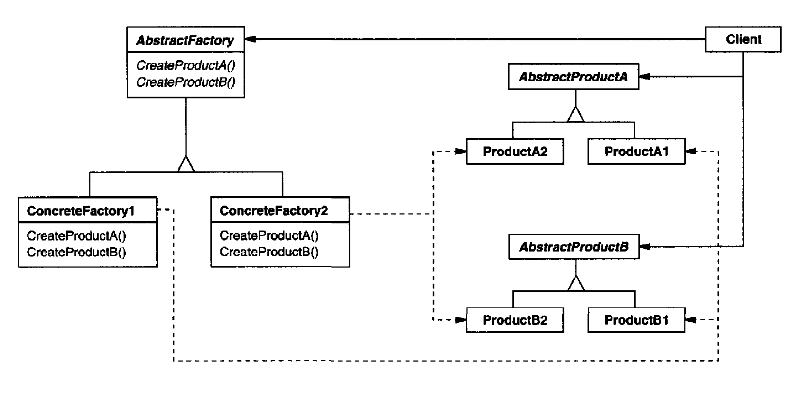

# Abstract Factory Pattern

## Introduction:

Provide an interface for creating families of related or dependent objects without specifying their concrete classes.


Abstract factory is for creating abstract interface, not concrete class.



## Motivation & When should use the pattern

* Clients don't know what is the concrete class they used from the **Abstract Factory.**
* A system should be independent of how its products are created, composed, and represented.
* A family of related product objects is designed to be used together, and you need to enforce this constraint. **\(that is, you want to make the system logics only run with couple of abstract interface\)**
* If you want to provide a class library of products, and you want to just reveal just their interfaces. **\(not implementations\)**

## Component:



#### **Abstract Factory: \(Abstract Interface\)**

Define interfaces for client to create **abstract Product**.

#### Concrete Factory:

Implements the Abstract Factory to create **Concrete Product.**

#### Abstract Product: \(Abstract Interface\)

Define interfaces for what a Product should look like.

#### Concrete Product:

Implements the Abstract Product to create specific Product object.

#### Client:

Uses only interfaces declared by Abstract Factory and Abstract Product.


## Code Example - Golang

```go
package main

import (
	"fmt"
)

// DeviceFactory is the Abstract Factory
type DeviceFactory interface {
	CreateLinuxDevice() Device
	CreatetWindowsDevice() Device
}

// Device is the Abstract Product
type Device interface {
	Type() string
}

// LinuxDevice is the Concrete Product
type LinuxDevice struct{}

func (d LinuxDevice) Type() string { return "linux" }

// WindowsDevice is the Concrete Product
type WindowsDevice struct{}

func (d WindowsDevice) Type() string { return "windows" }

// DefaultDeviceFactory is the Concrete Factory
type DefaultDeviceFactory struct{}

func (f DefaultDeviceFactory) CreateLinuxDevice() Device {
	// do something
	return LinuxDevice{}
}

func (f DefaultDeviceFactory) CreatetWindowsDevice() Device {
	// do something
	return WindowsDevice{}
}

func printDevice(d Device) {
	fmt.Println("Current Device is :", d.Type())
}

func main() {
	var factory DeviceFactory
	var device Device

	factory = DefaultDeviceFactory{}

	device = factory.CreateLinuxDevice()
	printDevice(device)

	device = factory.CreatetWindowsDevice()
	printDevice(device)
}

```


**NOTE**:

* It isolates concrete classes.
* It makes the exchanging product families easy.
* It promotes consistency between products.
* Adding new product will be kind of difficult.



