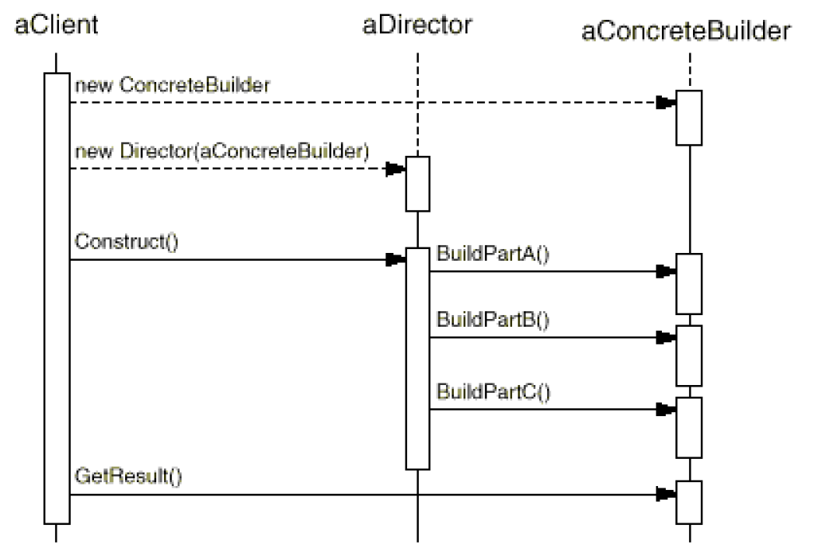

# Builder Pattern

### Instruction:

Separate the construction of a complex object from its representation so that the same construction process can create different representation.


 Builder pattern usually used with other **Creational Pattern**



### Motivation & When should use builder pattern

* Decouple the logic of representation and construction. 
* If the algorithm for creating complex object should be independent, and the client does not need to know how a object should be created. 
* The construction process \(A Director\) allow different representation for the object that's created.

### Component:



#### Builder:

The abstract interface for creating part of **Product** object.

#### Concrete Builder:

The subclass of Builder class, which implements the real logic of creating parts of **Product.**

#### Director:

It decides how to use the builder which client provides for building the entire **Product.**

> it hides how the **parts of a Product** get assembled

#### Product

The complex object, which is the target object the client wants to create.


The **Builder** provides a serious of interfaces to build the **parts of** **Product**, and the **Director** will choose how to assemble these interfaces to build the whole **Product** for the **Client**.



### Golang Example:

```go

```


