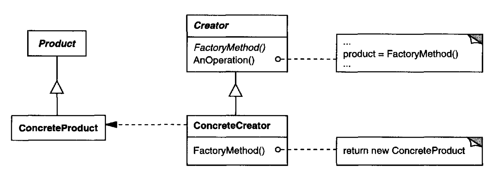

# Factory Method

## Introduction:

Define an interface for creating an object, but let subclass decide which class to instantiate.


Abstract factory Pattern is often implemented with factory methods.



## Motivation & When should use the pattern

* Frameworks use abstract classes to define and maintain relationships between objects.
* The Factory Method encapsulates the knowledge of which Product subclass to create and moves this knowledge out of the framework.
* A class can't anticipate the class of objects must create. **NOTE: common example is that a framework may ask its client to implement some specific method.**
* A class wants its subclasses to specify the objects to create.
* Classes delegate responsibility to one of several helper subclasses, and you want to localize the knowledge of which helper subclasses is the delegate.

## Component:



### Product:

Defines the interface of objects the factory method creates.

### Concrete Product:

Implements the **Product** interfaces.

### Creator:

Declare the factory method, which returns an object of type Product.   
Creator may also define default implementation of the factory method, and return the default **Concrete Product** object.

### Concrete Creator:

Overrides the factory method to return an instance of a **Concrete Product**.

## Code Example - Golang

Due to the Factory Method usually works with Abstract Factory Pattern, so we can also check the example  [here](https://georgenotes.gitbook.io/design-pattern/creational-pattern/abstract-factory-pattern#code-example-golang).

```go
package main
​
type GraphicFactory struct {}
​
func (f GraphicFactory) NewLine() {}
​
func (f GraphicFactory) NewCircle() {}
​
func (f GraphicFactory) NewSquare() {}
​
// ...
​
​
func main() {
    factory := GraphicFactory{}
    f.NewLine()
    f.NewCircle()
    f.NewSquare()
}
```



**NOTE**:

* The potential disadvantage of the **Factory Method** is that clients might have to subclass the Creator class just to create a particular **Concrete Product** object.
* The Factory Method works like a **hook** , and the client will use this function to do more flexible things.



