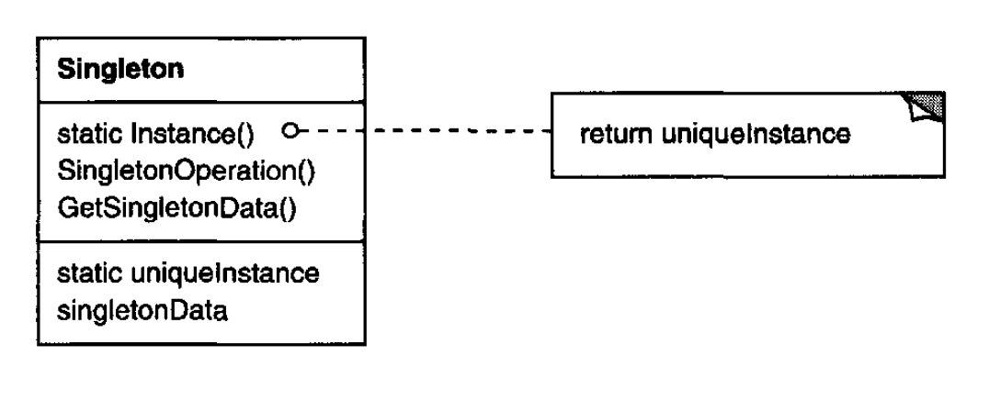

# Singleton

## Introduction:

Ensure a class only has one instance, and provide a global point of access to it.

## Motivation & When should use builder pattern

* Some class can only has exactly one instance. \(e.g. Only one _filesystem_ in the _OS_\)
* For this single instance, it must be accessible to clients from a well-known access point.
* When the sole instance should be extensible by subclassing, and clients should be able to use an extended instance _without modifying their code._

## Component:



### Singleton:

defines an Instance operation that lets clients access its unique instance. 

> Different language may have different way to implement the **Singleton Pattern**

## Code Example - Golang

```go
package main

import (
	"fmt"
	"sync"
	"time"
)

var singleton singletonStore = singletonStore{}

func Get() *UniqueProduct {
	return singleton.Instance()
}

type UniqueProduct struct {
	name string
}

type singletonStore struct {
	once     sync.Once
	instance *UniqueProduct
}

func (s *singletonStore) Instance() *UniqueProduct {
	s.once.Do(func() {
		// initialize the unique product
		name := fmt.Sprintf("Product-time-%s", time.Now().Format(time.RFC3339Nano))
		s.instance = &UniqueProduct{name}
	})
	// return the store's unique product
	return s.instance
}

func main() {
	product := Get()

	fmt.Println("The product:", product)
	fmt.Println("The product:", product)
	fmt.Println("The product:", product)
}

```


**NOTE**:



