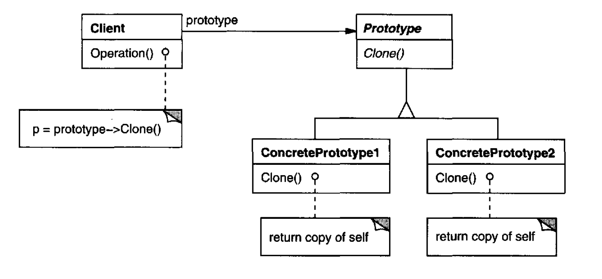

# Prototype

## Introduction:

Specify the kinds of objects to create using a prototypical instance, and create new objet by copying this prototype.


**Prototype** and **Abstract Factory** pattern are competing patterns in some ways. They can also be used together.

Design with **Composite** or** Decorater**  Pattern can also benefit from the **Prototype** pattern


## Motivation & When should use builder pattern

* Use the Prototype pattern when a system should be independent of how its products are created, composed and represented.
* When Class instance are instantiated at run-time. \(e.g. dynamic loading\)
* To avoid building product class hierarchy of factories. \(e.g. Prototype manager can reduce lots parallel product classes\)
* When instances of a class can have one of only a few different combinations of state. \(similar to above\).

## Component:



### Prototype:

Declares an interface for cloning itself.

### Concerete Prototype:

Implements the operation for cloning itself.

### Client:

Creates a new object by asking a prototype to clone itself. 

## Code Example - Golang

```go
package main

import "fmt"

const (
	NoShape = iota // 0
	Circle
	Square
	Retangle
)

type PrototypeWidge interface {
	init(int)
	Clone() *Widge
}

type UIWdige interface {
	Render()
}

type PrototypeWidgeFactory interface {
	NewWidge(shape int) *Widge
}

type Widge struct {
	shape int
}

func (w *Widge) init(shape int) {
	w.shape = shape
}

func (w *Widge) Clone() *Widge {
	return &Widge{w.shape}
}

func (w *Widge) Render() {
	fmt.Printf("Rendering [%d] Widge\n", w.shape)
}

type UIWidgeFactory struct {
	protoWidge PrototypeWidge
}

func (f UIWidgeFactory) NewWidge(shape int) UIWdige {
	widge := f.protoWidge.Clone()
	switch shape {
	case Circle:
		widge.init(Circle)
	case Square:
		widge.init(Square)
	case Retangle:
		widge.init(Retangle)
	default:
		widge.init(NoShape)
	}
	return widge
}

func main() {
	var f = UIWidgeFactory{&Widge{}}

	f.NewWidge(Circle).Render()
	f.NewWidge(Square).Render()
}

```


**NOTE**:

* 



