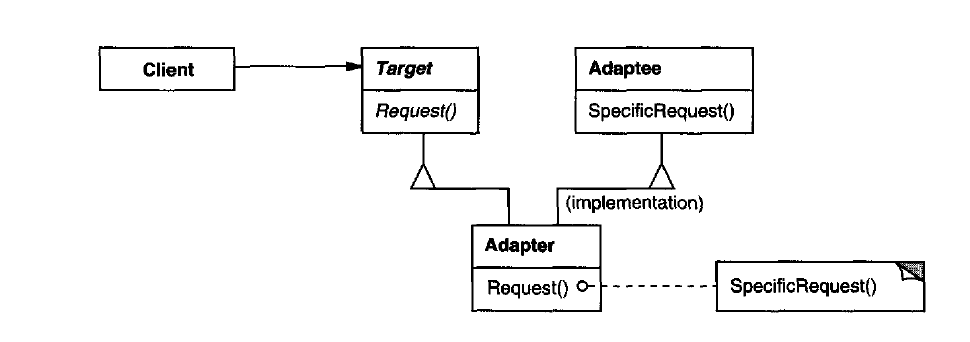
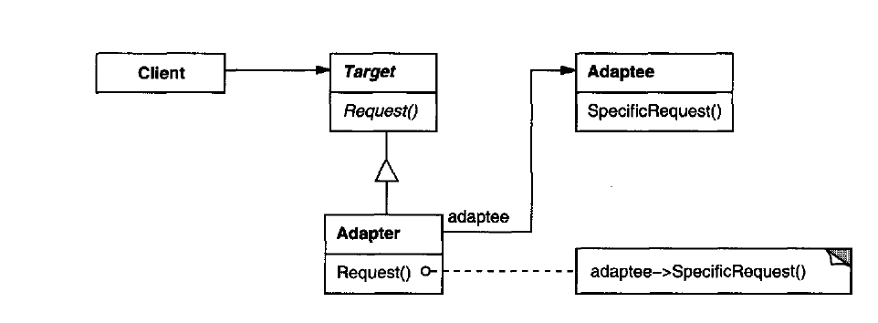
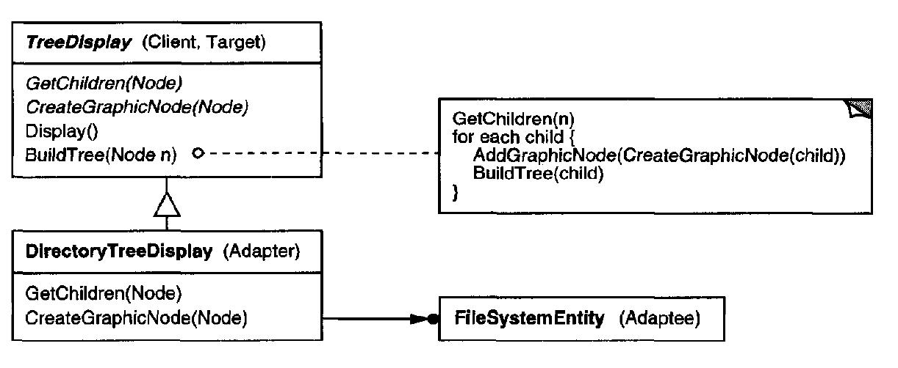
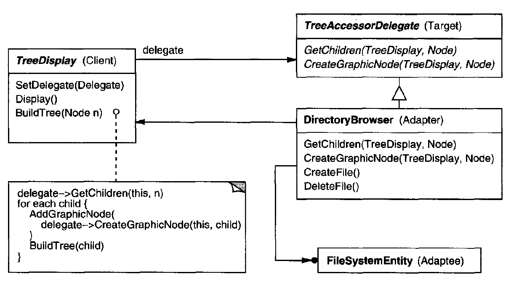

# Adapter  \(Wrapper\)

## Introduction:

Convert the interface of a class into another interface clients expect.  Adapter lets classes work together that couldn't otherwise because of incompatible interfaces.


* Class based Adapter is built by using use multiple inheritance.
* Object based Adapter is built by using object Composition.



## Motivation & When should use builder pattern

* You want to use an existing class, and its interface does not match the one you need.
* You want to create a reusable class that cooperates with unrelated or unforeseen classes.
* You need to use several existing subclasses, but it's impractical to adapt their interface by 
* subclassing everyone.

## Component:

### Class based Adapter




### Object based Adapter



#### Target: \(Abstract interface\)

Defines the domain-specific interface that Client uses.

#### Client:

Collaborates with objects conforming to the Target interface.

#### Adapter: \(subclass of the Target\)

Adapts the interface of Adaptee to the Target interface.

#### Adaptee:

Defines an existing interface which needs adapting.


## Code Example - Golang

### Pluggable Adapter - Type 1 :



### Pluggable Adapter - Type 2 delegate:




```go
package main

import "fmt"

// Adaptee
type MySQLConn struct{}

func (conn MySQLConn) Query(q string) []string {
	return []string{"Result from mysql"}
}

// Adaptee
type MongoConn struct{}

type jsonM map[string]interface{}

func (conn MongoConn) Find(filter jsonM) []string {
	return []string{"Result from mongo"}
}

// Adapter
type MySQLStore struct {
	driver MySQLConn
}

func (store MySQLStore) FindProduct(ID string) Product {
	return Product{
		ID: store.driver.Query(ID)[0],
	}
}

// Adapter
type MongoStore struct {
	driver MongoConn
}

func (store MongoStore) FindProduct(ID string) Product {
	q := map[string]interface{}{
		"ID": ID,
	}
	return Product{
		ID: store.driver.Find(q)[0],
	}
}

type Product struct {
	ID string
}

// Target
type Store interface {
	FindProduct(ID string) Product
}

func printProduct(store Store, ID string) {
	product := store.FindProduct(ID)
	fmt.Println("Product is :", product)
}

func main() {
	printProduct(MySQLStore{}, "1")
	printProduct(MongoStore{}, "1")
}

```


**NOTE**:

The multiple inheritance is not recommended in the modern languages, so we will skip this in the code example.



