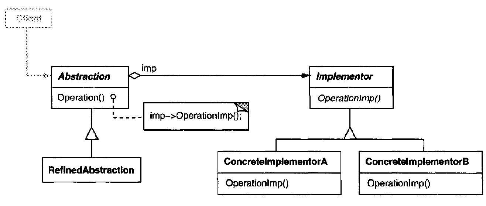

# Bridge \(Handle/Body\)

## Introduction: {#introduction}

Decouple an abstraction from its implementation so that the two can vary independently.

## Motivation & When should use builder pattern {#motivation-and-when-should-use-builder-pattern}

* ​You want to avoid a permanent binding between an abstraction and its implementation.
* _**\(if the implementation need to be switched at run-time\)**_ Both the abstractions and implementations should be extensible by subclassing.
* Changes in the implementation of an abstraction should have no impact on clients.
* Hide the implementation of an abstraction completely from clients.
* You want to share an implementation among multiple objects.

## Component: {#component}



### Abstraction: \(interface for clients to use\)

​Defines the abstraction's interface

Maintains a reference to an object of type Implementor

### Refined Abstractions:

Extends the interface defined by Abstraction

### Implementor: \(The implementation abstraction\)

Defines the interface for implementation classes.   
_\(This doesn't need to correspond exactly to Abstraction's interface\)_

### Concrete Implementor:

Implements the **Implementator's** interface

## Code Example - Golang {#code-example-golang}

```go
package main

import (
	"context"
	"fmt"
	"time"
)

// Service Abstractation
type Service interface {
	Start()
	Stop()
}

// Concrete Service which implements the Service
type DeviceMonitor struct {
	impl     DeviceMonitorImpl
	ctx      context.Context
	cancelFn context.CancelFunc
}

func (svc *DeviceMonitor) Start() {
	svc.Stop()

	svc.ctx, svc.cancelFn = context.WithCancel(
		context.Background(),
	)

	for {

		select {
		case <-svc.ctx.Done():
			return
		default:
			svc.impl.ShowName()
			svc.impl.ShowIP()
		}
		<-time.After(time.Second)
	}
}

func (svc *DeviceMonitor) Stop() {
	if svc.cancelFn != nil {
		svc.cancelFn()
	}
}

// The Abstraction of DeviceMonitor Implementator
type DeviceMonitorImpl interface {
	ShowName() string
	ShowIP() string
	// ...
}

// Windows Platform dependent Implementator
type WinMonitor struct{}

func (win WinMonitor) ShowName() string {
	fmt.Println("Executing hostname.exe ...")
	return "Windows-PC"
}

func (win WinMonitor) ShowIP() string {
	fmt.Println("Executing cmd: ipconfig ")
	return "1.1.1.1"
}

// Linux Platform dependent Implementator
type LinuxMonitor struct{}

func (linux LinuxMonitor) ShowName() string {
	fmt.Println("Executing hostname.sh ...")
	return "Linux-PC"
}

func (linux LinuxMonitor) ShowIP() string {
	fmt.Println("Executing cmd: ifconfig ")
	return "1.1.1.1"
}

func main() {

	// switch to Windows platform
	var svc Service = &DeviceMonitor{
		impl: WinMonitor{},
	}
	go func() {
		<-time.After(3 * time.Second)
		svc.Stop()
	}()
	svc.Start()

	fmt.Println("===================================")

	// switch to Linux platform
	svc = &DeviceMonitor{
		impl: LinuxMonitor{},
	}

	go func() {
		<-time.After(3 * time.Second)
		svc.Stop()
	}()
	svc.Start()

}
​​
```


**NOTE**:

* An Abstract Factory can create and configure Bridges
* Adapter Pattern is usually applied to systems after they are designed.
* Bridge, on the other hand, is used up-front in a design to let abstractions and implementations vary independently 



​

​

